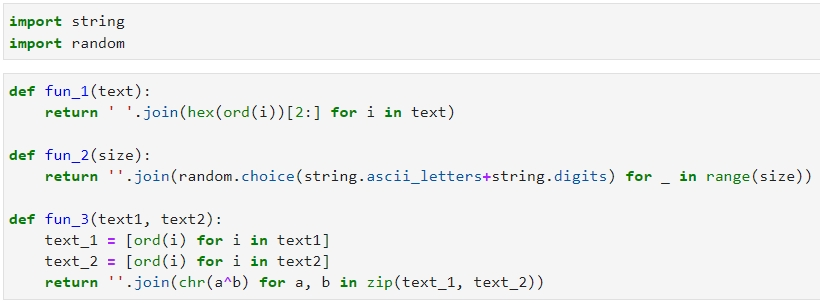
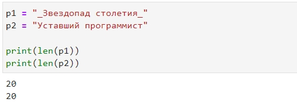
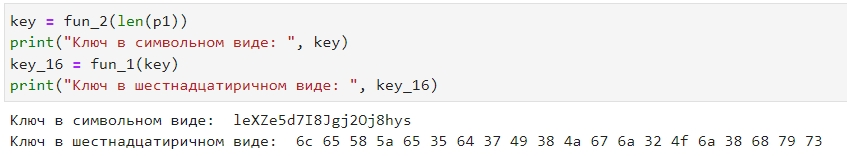
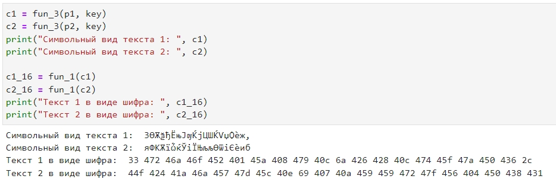
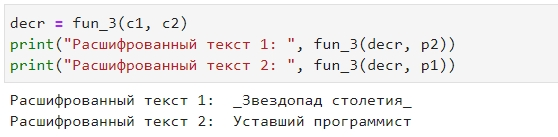

---
# Front matter
lang: ru-RU
title: Защита лабораторной работы №8. Элементы криптографии. Шифрование (кодирование) различных исходных текстов одним ключом 
author: "Бурдина Ксения Павловна"
group: NFIbd-01-19
institute: RUDN University, Moscow, Russian Federation
date: 2022 Oct 19th

# Formatting
toc: false
slide_level: 2
header-includes: 
 - \metroset{progressbar=frametitle,sectionpage=progressbar,numbering=fraction}
 - '\makeatletter'
 - '\beamer@ignorenonframefalse'
 - '\makeatother'
aspectratio: 43
section-titles: true
theme: metropolis

---

# Результат выполнения лабораторной работы №8

# Цель выполнения лабораторной работы 

## Цель выполнения лабораторной работы

Освоить на практике применение режима однократного гаммирования на примере кодирования различных исходных текстов одним ключом.

# Теоретические сведения

## Теоретические сведения

Схема шифрования двух различных текстов одним ключом:

## Теоретические сведения

Шифротексты обеих телеграмм можно найти следующим образом:

$$C_1 = P_1 \oplus K$$

$$C_2 = P_2 \oplus K$$

Открытый текст можно найти, зная шифротекст двух телеграмм, зашифрованных одним ключом:

$$C_1 \oplus C_2 = P_1 \oplus K \oplus P_2 \oplus K = P_1 \oplus P_2$$

# Результат выполнения лабораторной работы

## Результат выполнения лабораторной работы

Постановка задачи:

Два текста кодируются одним ключом (однократное гаммирование). Требуется не зная ключа и не стремясь его определить, прочитать оба текста. Необходимо разработать приложение, позволяющее шифровать и дешифровать тексты $P_1$ и $P_2$ в режиме однократного гаммирования. Приложение должно определить вид шифротекстов $C_1$ и $C_2$ обоих текстов $P_1$ и $P_2$ при известном ключе. Необходимо определить и выразить аналитически способ, при котором злоумышленник может прочитать оба текста, не зная ключа и не стремясь его определить.

## Результат выполнения лабораторной работы

Ввод импортов и определение функций, которые будем использовать:

{width=90%}

## Результат выполнения лабораторной работы

Ввод текстов и определение их длины:

{width=90%}

## Результат выполнения лабораторной работы

Определение шаблонного ключа:

{width=90%}

## Результат выполнения лабораторной работы

Шифрование текстов в символьном и шестнадцатиричном виде по ключу:

{width=85%}

## Результат выполнения лабораторной работы

Расшифровка зашифрованных текстов:

{width=90%}

# Выводы

## Выводы

1. Изучили теорию по теме однократного гаммирования для кодирования различных исходных текстов одним ключом;

2. Реализовали режим однократного гаммирования на практике, написав программу.
