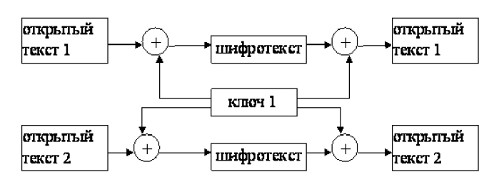
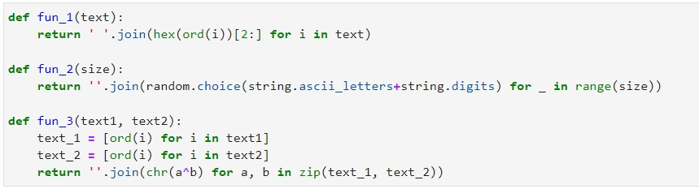
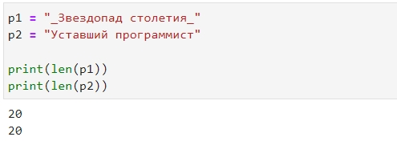
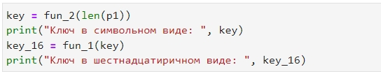
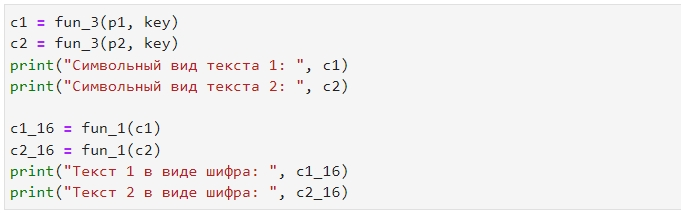
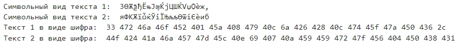
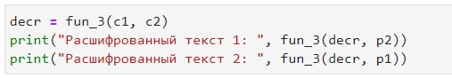
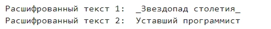

---
# Front matter
title: "Отчет по лабораторной работе №8"
subtitle: "Элементы криптографии. Шифрование (кодирование) различных исходных текстов одним ключом"
author: "Бурдина Ксения Павловна"
group: NFIbd-01-19
institute: RUDN University, Moscow, Russian Federation
date: 2022 Oct 19th

# Generic otions
lang: ru-RU
toc-title: "Содержание"

# Pdf output format
toc: true # Table of contents
toc_depth: 2
lof: true # List of figures
fontsize: 12pt
linestretch: 1.5
papersize: a4
documentclass: scrreprt
### Fonts
mainfont: PT Serif
romanfont: PT Serif
sansfont: PT Sans
monofont: PT Mono
mainfontoptions: Ligatures=TeX
romanfontoptions: Ligatures=TeX
sansfontoptions: Ligatures=TeX,Scale=MatchLowercase
monofontoptions: Scale=MatchLowercase,Scale=0.9
## Biblatex
biblatex: true
biblio-style: "gost-numeric"
biblatexoptions:
  - parentracker=true
  - backend=biber
  - hyperref=auto
  - language=auto
  - autolang=other*
  - citestyle=gost-numeric
## Misc options
indent: true
header-includes:
  - \linepenalty=10 # the penalty added to the badness of each line within a paragraph (no associated penalty node) Increasing the value makes tex try to have fewer lines in the paragraph.
  - \interlinepenalty=0 # value of the penalty (node) added after each line of a paragraph.
  - \hyphenpenalty=50 # the penalty for line breaking at an automatically inserted hyphen
  - \exhyphenpenalty=50 # the penalty for line breaking at an explicit hyphen
  - \binoppenalty=700 # the penalty for breaking a line at a binary operator
  - \relpenalty=500 # the penalty for breaking a line at a relation
  - \clubpenalty=150 # extra penalty for breaking after first line of a paragraph
  - \widowpenalty=150 # extra penalty for breaking before last line of a paragraph
  - \displaywidowpenalty=50 # extra penalty for breaking before last line before a display math
  - \brokenpenalty=100 # extra penalty for page breaking after a hyphenated line
  - \predisplaypenalty=10000 # penalty for breaking before a display
  - \postdisplaypenalty=0 # penalty for breaking after a display
  - \floatingpenalty = 20000 # penalty for splitting an insertion (can only be split footnote in standard LaTeX)
  - \raggedbottom # or \flushbottom
  - \usepackage{float} # keep figures where there are in the text
  - \floatplacement{figure}{H} # keep figures where there are in the text
---

# Цель работы

Целью данной работы является освоение на практике применение режима однократного гаммирования на примере кодирования различных исходных текстов одним ключом.

# Теоретическое введение

Режим шифрования однократного гаммирования одним ключом двух видов открытого текста реализуется в соответствии со схемой:

Шифротексты обеих телеграмм можно получить по формулам режима однократного гаммирования:

$$C_1 = P_1 \oplus K$$

$$C_2 = P_2 \oplus K$$

Открытый текст можно найти, зная шифротекст двух телеграмм, зашифрованных одним ключом. Для этого оба равенства складываются по модулю 2. Тогда с учетом операции XOR получаем:

$$C_1 \oplus C_2 = P_1 \oplus K \oplus P_2 \oplus K = P_1 \oplus P_2$$

Предположим, что одна из телеграмм является шаблоном, т.е. имеет текст фиксированный формат, в который вписываются значения полей [[1]](https://esystem.rudn.ru/pluginfile.php/1651895/mod_resource/content/2/008-lab_crypto-key.pdf). Допустим, что злоумышленнику этот формат известен. Тогда он получает достаточно много пар $C_1 \oplus C_2$ (известен вид обеих шифровок). Тогда зная $P_1$ и учитывая свойства операции XOR, имеем:

$$C_1 \oplus C_2 \oplus P_1 = P_1 \oplus P_2 \oplus P_1 = P_2$$

Таким образом, злоумышленник получает возможность определить те символы сообщения $P_2$, которые находятся на позициях известного шаблона сообщения $P_1$. В соответствии с логикой сообщения $P_2$, злоумышленник имеет реальный шанс узнать ещё некоторое количество символов сообщения $P_2$. Затем вновь используется формула с подстановкой вместо $P_1$ полученных на предыдущем шаге новых символов сообщения $P_2$. И так далее. Действуя подобным образом, злоумышленник даже если не прочитает оба сообщения, то значительно уменьшит пространство их поиска.

# Ход выполнения лабораторной работы

Задача ставится следующая: Два текста кодируются одним ключом (однократное гаммирование). Требуется не зная ключа и не стремясь его определить, прочитать оба текста. Необходимо разработать приложение, позволяющее шифровать и дешифровать тексты $P_1$ и $P_2$ в режиме однократного гаммирования. Приложение должно определить вид шифротекстов $C_1$ и $C_2$ обоих текстов $P_1$ и $P_2$ при известном ключе. Необходимо определить и выразить аналитически способ, при котором злоумышленник может прочитать оба текста, не зная ключа и не стремясь его определить.

Для написания приложения будем использовать среду Jupyter. Выполним необходимую задачу.

1. Начнем с того, что введем необходимые нам для работы импорты:

{width=70%}

2. Далее определим функции, которые мы будем использовать:

Первая функция у нас преобразует символьное представление текста в шестнадцатиричный вид.

Вторая отвечает за назначение каждому символу введенного текста определенного значения из символов Unicode.

А в третьей функции мы прописываем нахождение шифров обоих текстов по одному ключу и далее их расшифровка.

3. Теперь пропишем листинг нашей программы.

Вводим два текста и выводим для проверки их длину (потому что нам требуются тексты с одинаковой длиной для подбора шаблонного ключа):

{width=90%}

4. Пропишем нахождение ключа для одного из текстов, чтобы потом использовать его в качестве шаблона:

При нахождении ключа используем функцию 2 для составления символьного шифра, после чего преобразуем каждый выявленный символ в шестнадцатиричный вид с помощью функции 1 и выводим рещультат на экран:

5. Далее найдем шифр для каждого из текстов:

{width=90%}

Используем функцию 3, которая помогает сделать шифровку для наших текстов. Сначала выводим тексты в символьном виде, после чего преобразуем их в шифр шестнадцатиричного вида и выводим на экран результат:

6. Теперь, используя опять же функцию 3, сделаем преобразование шифра в символы необходимого алфавита. При этом заменяем текст сообщения 1 на текст сообщения 2, так как при подстановке шаблона ключа у нас изменился порядок текстов:

{width=90%}

И в итоге получим наши изначальные тексты:

{width=90%}

# Листинг программы

    import string
    import random

    def fun_1(text):
      return ' '.join(hex(ord(i))[2:] for i in text)
    def fun_2(size):
      return ''.join(random.choice(string.ascii_letters+string.digits) for _ in range(size))
    def fun_3(text1, text2):
      text_1 = [ord(i) for i in text1]
      text_2 = [ord(i) for i in text2]
      return ''.join(chr(a^b) for a, b in zip(text_1, text_2))
    
    p1 = "_Звездопад столетия_"
    p2 = "Уставший программист"
    print(len(p1))
    print(len(p2))

    key = fun_2(len(p1))
    print("Ключ в символьном виде: ", key)
    key_16 = fun_1(key)
    print("Ключ в шестнадцатиричном виде: ", key_16)

    c1 = fun_3(p1, key)
    c2 = fun_3(p2, key)
    print("Символьный вид текста 1: ", c1)
    print("Символьный вид текста 2: ", c2)

    c1_16 = fun_1(c1)
    c2_16 = fun_1(c2)
    print("Текст 1 в виде шифра: ", c1_16)
    print("Текст 2 в виде шифра: ", c2_16)

    decr = fun_3(c1, c2)
    print("Расшифрованный текст 1: ", fun_3(decr, p2))
    print("Расшифрованный текст 2: ", fun_3(decr, p1))

# Выводы

В ходе работы мы освоили на практике применение режима однократного гаммирования на примере кодирования различных исходных текстов одним ключом.

# Контрольные вопросы

1. Как, зная один из текстов ($P_1$ или $P_2$), определить другой, не зная при этом ключа?

Необходимо попытаться определить длину ключа, а затем разделить сообщение на несколько частей. Если правильно определить ключ, то перед пользователем будет вариант из определенного количества простых криптограмм с заменой Цезаря, которые нужно будет разгадать. 

3. Как реализуется режим шифрования однократного гаммирования одним
ключом двух открытых текстов?

Режим шифрования однократного гаммирования одним ключом двух видов открытого текста реализуется в соответствии со схемой:

Шифротексты обеих телеграмм можно получить по формулам режима однократного гаммирования:

$$C_1 = P_1 \oplus K$$

$$C_2 = P_2 \oplus K$$

Открытый текст можно найти, зная шифротекст двух телеграмм, зашифрованных одним ключом. Для этого оба равенства складываются по модулю 2. Тогда с учетом операции XOR получаем:

$$C_1 \oplus C_2 = P_1 \oplus K \oplus P_2 \oplus K = P_1 \oplus P_2$$

4. Перечислите недостатки шифрования одним ключом двух открытых
текстов.

Преимущества открытых тектов:

- Не нужно предварительно передавать секретный ключ по надёжному каналу;
- Только одной стороне известен ключ дешифрования, который нужно держать в секрете;
- В больших сетях число ключей в открытой криптосистеме значительно меньше, чем в симметричной.

5. Перечислите преимущества шифрования одним ключом двух открытых
текстов.

Недостатки алгоритма открытого шифрования:

- В алгоритм сложнно внести изменения;
- При открытом алгоритме используются порой слишком длинные ключи, которые тяжело подобрать;
- Шифрование-расшифровывание с использованием пары ключей проходит на два-три порядка медленнее, чем шифрование-расшифрование того же текста симметричным алгоритмом;
- Требуются существенно большие вычислительные ресурсы, поэтому на практике открытые криптосистемы нужно использовать в сочетании с другими алгоритмами.

